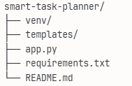

Smart Task Planner - Complete Concept Guide
🎯 What Is It?
A Smart Task Planner is an AI-powered application that takes a vague goal (like "Launch a product in 2 weeks") and automatically breaks it down into:

Specific tasks (What to do)
Timeline (When to do it)
Dependencies (What must be done before what)

file stucture :


Think of it as having a project manager AI that understands your goal and creates a detailed action plan instantly.
🧠 Core Concepts Explained
1. Goal → Tasks Breakdown

Input: "Launch an e-commerce website in 30 days"
AI Processing: Analyzes the goal and identifies logical steps
Output:

Task 1: Choose domain name (Day 1-2)
Task 2: Design homepage mockup (Day 3-5, depends on Task 1)
Task 3: Set up payment gateway (Day 10-15)
etc.


2. Dependencies
Dependencies mean "Task B can't start until Task A is done"

Example: You can't test a website before building it
The AI identifies these logical relationships

3. Timeline Estimation
The AI estimates how long each task takes based on:

Complexity of the task
Industry standards
Total deadline provided
4. LLM (Large Language Model) Role
Gemini acts as the "brain" that:

Understands natural language goals
Reasons about task sequences
Generates realistic timelines
Identifies what depends on what

User Input (Goal) 
    ↓
Backend API (Python/Node.js)
    ↓
Gemini AI (Processes & reasons)
    ↓
Structured Task Plan
    ↓
Database (Optional - saves plans)
    ↓
Frontend (Displays tasks visually)

Concept Mastery Map:
1️⃣ LLM (Gemini) Role

What: Gemini reads your goal and "thinks" like a project manager
How: You send a detailed prompt → Gemini returns structured tasks
Why: Saves hours of manual planning
2️⃣ Prompt Engineering
Bad Prompt: "Break down my goal"
Good Prompt: "Break down into 5-10 tasks with dependencies, 
             priorities, and realistic timelines in JSON format"
```
The better the prompt = better the output

3️⃣ **Dependencies Logic**
```
Task 1: Design mockup (no dependencies)
Task 2: Build frontend (depends on Task 1)
Task 3: Test website (depends on Task 2)
```
Can't test before building!

#### 4️⃣ **API Architecture**
```
Frontend (HTML) 
   ↓ (sends goal)
Backend (Flask) 
   ↓ (processes with Gemini)
AI Response 
   ↓ (formats data)
Frontend (displays tasks)

 Environment Setup

 # Install Python from python.org if needed
pip install flask google-generativeai python-dotenv


 Get Gemini API Key

Go to https://makersuite.google.com/app/apikey
Create new API key
Copy it safely

 Code the Backend


Replace API key
Test run: python app.py

Create templates folder
Copy index.html code I provided
Test in browser at localhost:5000

Testing

Test with 3 different goals
Check if tasks make sense
Verify dependencies work